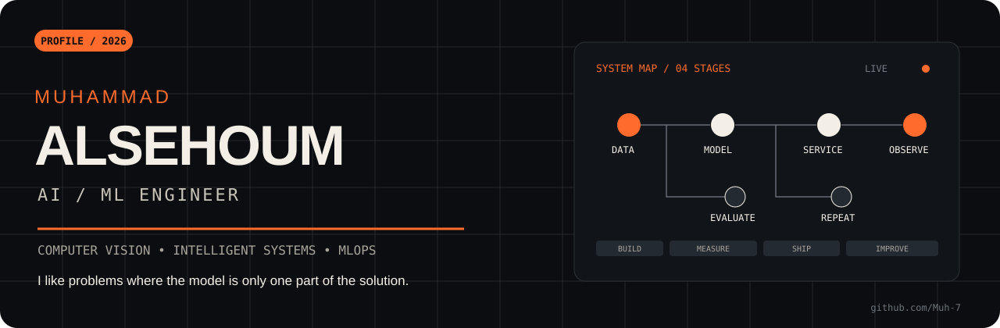

  

  <a href="https://github.com/Muh-7"><b>GitHub</b></a>
  &nbsp;&nbsp;·&nbsp;&nbsp;
  <a href="https://www.linkedin.com/in/muhammad-alsehoum-7ab688294"><b>LinkedIn</b></a>
  &nbsp;&nbsp;·&nbsp;&nbsp;
  <a href="mailto:muhammad.alsehoum2000@gmail.com"><b>Email</b></a>

 

01 / PROFILE

The model is not the whole system.

I build AI and machine-learning systems across computer vision, sequence analysis, real-time analytics, and intelligent software.

What interests me most is the engineering around the model: how data enters the system, how predictions are evaluated, how the result becomes usable, and how the whole pipeline can be reproduced and improved.

My current direction is moving deeper into MLOps and production ML — packaging, automation, CI/CD, reproducible workflows, deployment, and monitoring.

Working rule: make the experiment clear enough to trust, and the system simple enough to run again.

02 / SELECTED SYSTEMS

Work that explains me better than a skill list.

<table>
<tr>
<td width="50%" valign="top">

01 — DNA Mutation Analyzer

A computational pipeline for studying single-nucleotide variants across sequence structure, genomic context, expression, splicing, and transcription-factor motifs.

GENCODE GRCh38 AlphaGenome JASPAR FIMO Gradio

Why it matters: one project connecting bioinformatics data, external models, local analysis, and an interactive interface.

Explore the system →

</td>
<td width="50%" valign="top">

02 — Traffic Speed Analytics

A real-time video pipeline that detects vehicles, tracks identities, estimates speed, and produces traffic statistics and reports.

YOLOv8 ByteTrack OpenCV Pandas

Why it matters: perception is only the beginning; the useful output is the analytics built around it.

Explore the system →

</td>
</tr>
<tr>
<td width="50%" valign="top">

03 — Sign Language Recognition

A real-time gesture-recognition system trained on a custom 11,000-image dataset, using MobileNetV3 and OpenCV for live inference.

TensorFlow MobileNetV3 OpenCV Transfer Learning

Why it matters: data collection, preprocessing, training, and live inference were treated as one pipeline.

Explore the system →

</td>
<td width="50%" valign="top">

04 — AlsehoumMiniNN

A small neural-network framework implemented from scratch with NumPy: dense layers, activations, losses, backpropagation, optimizers, mini-batches, and validation tracking.

NumPy Backpropagation SGD Momentum Adam

Why it matters: abstractions are easier to use when you have built the machinery underneath them.

Explore the framework →

</td>
</tr>
</table>

03 / TOOLBOX

Tools I reach for.

  

Modeling — TensorFlow / Keras · Scikit-learn · classical ML · deep learning
Vision — OpenCV · YOLO · detection · tracking · recognition · image pipelines
Data — NumPy · Pandas · PostgreSQL · preprocessing · evaluation
Systems — Docker · Git · GitHub Actions · FastAPI · Linux · reproducible workflows

04 / NOW

What I am sharpening next.

ML experiment
    ↓
reproducible training
    ↓
versioned model + data assumptions
    ↓
service / container
    ↓
automated checks
    ↓
deployment
    ↓
monitoring + iteration

The direction is deliberate: less “model in a notebook,” more complete ML system.

05 / ENGINEERING NOTES

A few things I care about.

Readable pipelines over clever but fragile code.

Evaluation before celebration. A model score needs context.

Reproducibility because “it worked once” is not an engineering result.

Useful interfaces because a strong model that nobody can use is unfinished work.

Learning by building — especially when the project forces me into a new domain.

06 / CONNECT

If the problem is interesting, I want to hear about it.

I am especially interested in work around AI engineering, computer vision, applied ML, and MLOps.

GitHub · LinkedIn · Email

 

  BUILD → MEASURE → SHIP → IMPROVE

