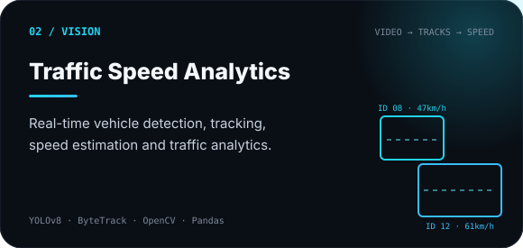
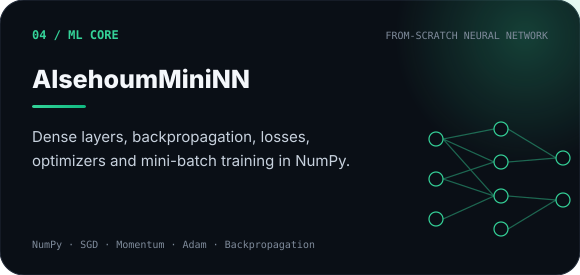
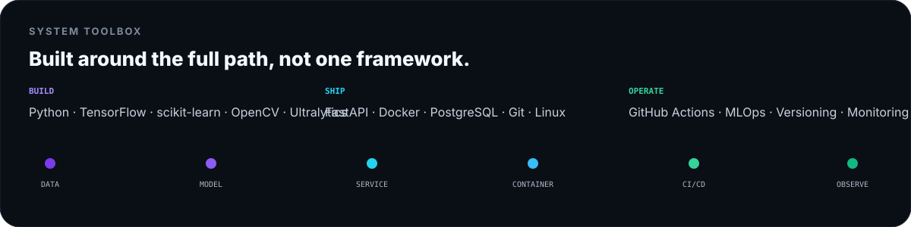
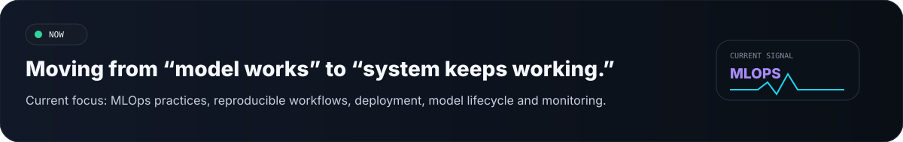

  

 

<table>
<tr>
<td width="50%">

</td>
<td width="50%">

</td>
</tr>
<tr>
<td width="50%">

</td>
<td width="50%">

</td>
</tr>
</table>

 

  

  

 

  <a href="https://github.com/Muh-7"><b>GitHub</b></a>
  &nbsp;&nbsp;·&nbsp;&nbsp;
  <a href="https://www.linkedin.com/in/muhammad-alsehoum-7ab688294"><b>LinkedIn</b></a>
  &nbsp;&nbsp;·&nbsp;&nbsp;
  <a href="mailto:muhammad.alsehoum2000@gmail.com"><b>Email</b></a>

  AI systems · computer vision · machine learning · MLOps

